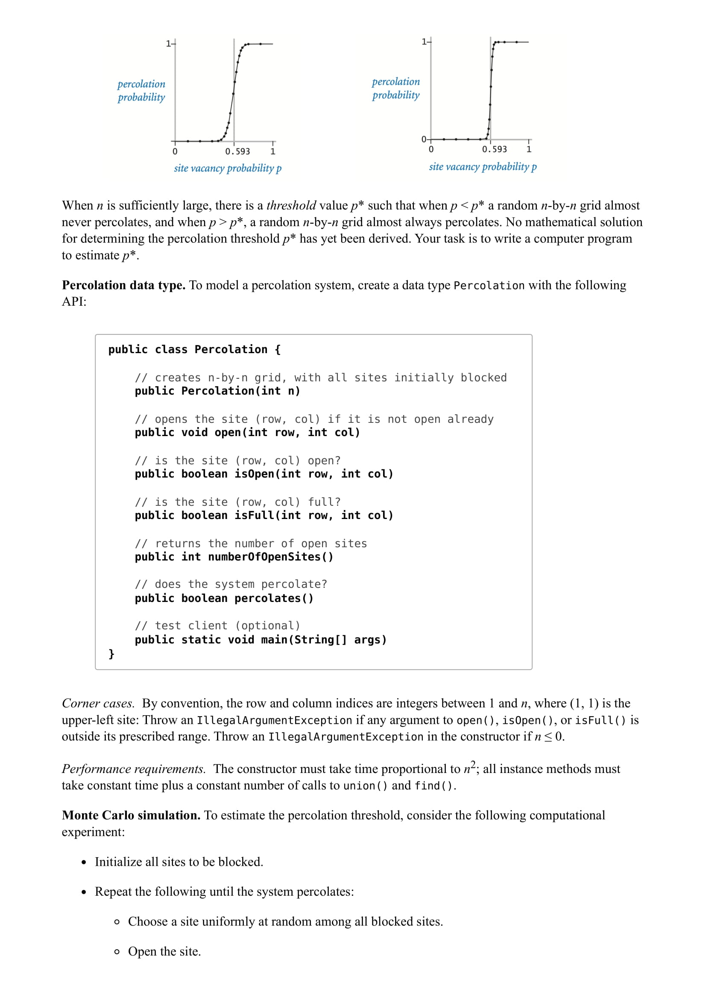
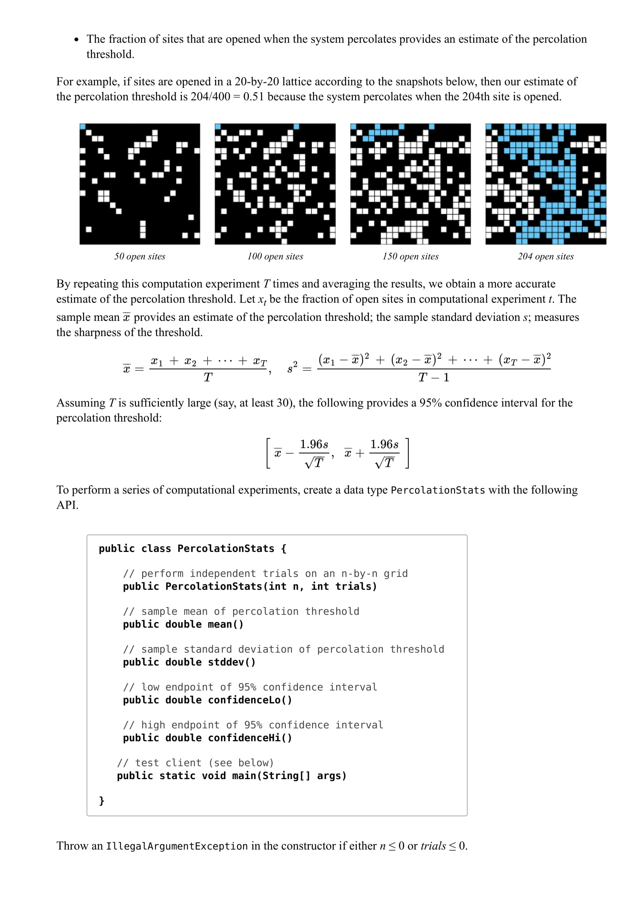
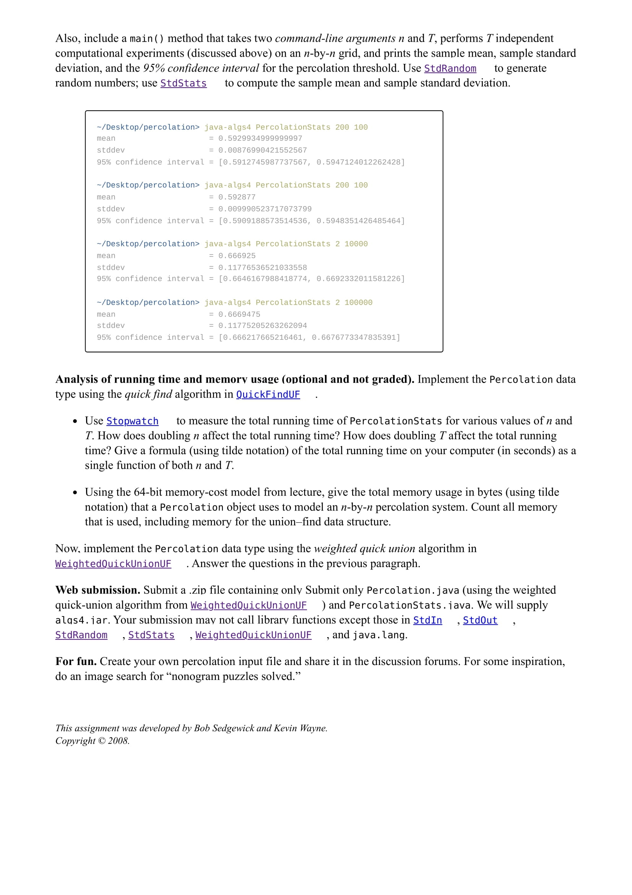

# Algorithms, Part I

## Programming Assignment: Percolation

### Implementation Approach

Union-Find structure with virtual top (source) and bottom (sink) sites.

### TODO
- Handle backwash
- Implement bonus assignments

### External Dependencies
- algs4.jar

